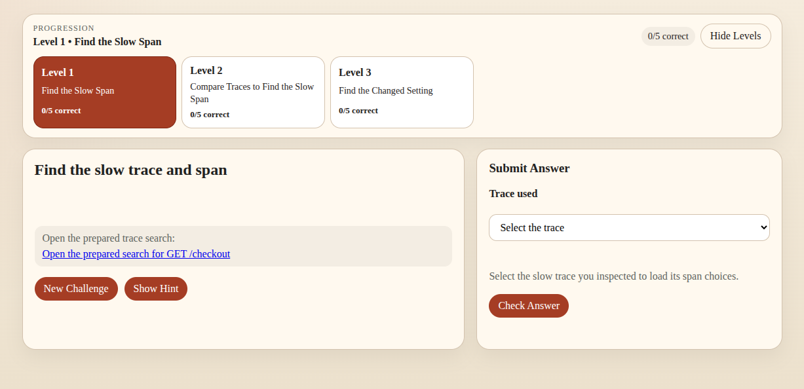
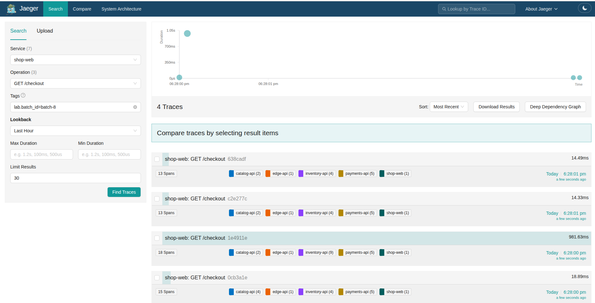
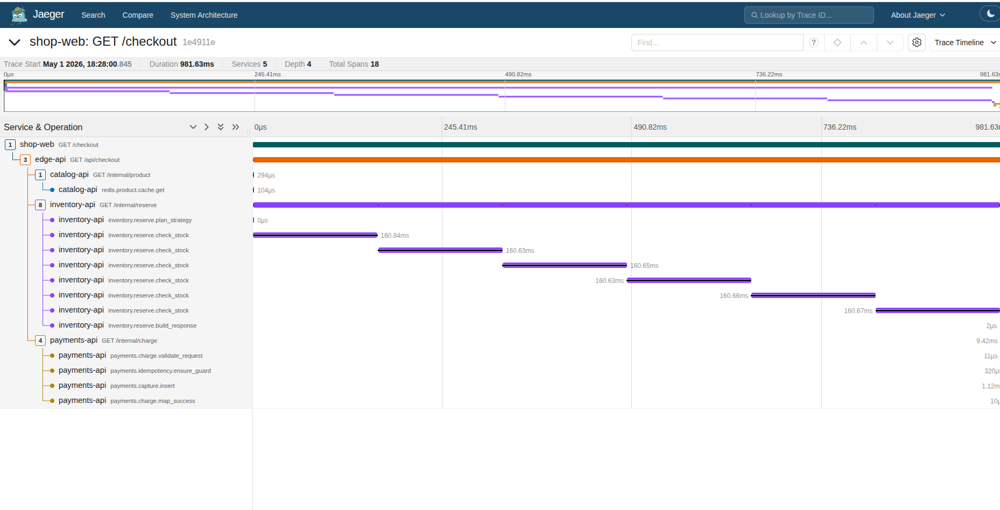
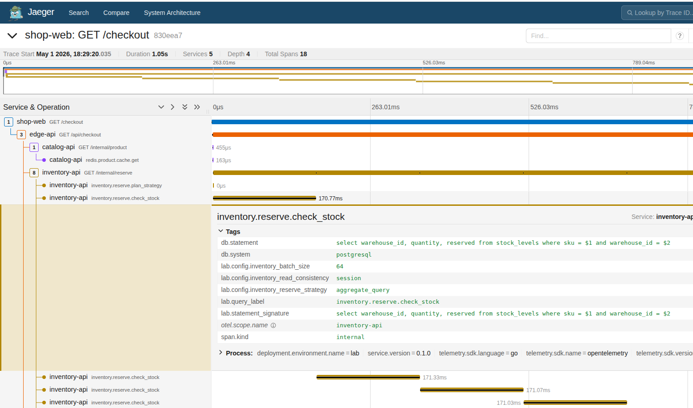
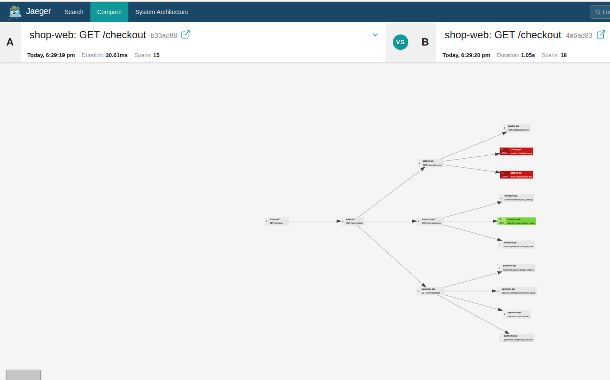

# Cloud Tracing Lab

Running at [iximiuz Labs](https://labs.iximiuz.com/playgrounds/cloud-tracing-lab-1a132e9c).



This repo contains a deliberate-practice lab for trace-driven incident diagnosis in a realistic local `k3s` environment.

The lab is built around:

- direct `localhost` ports for local runs and ingress for generic remote clusters
- a Python web tier
- mixed Go and Python application services
- PostgreSQL, Redis, and Meilisearch as the data tier
- OpenTelemetry for trace generation
- Jaeger for trace exploration
- a three-level coach UI that generates challenge traffic, opens prepared Jaeger searches or comparisons, grades required evidence, tracks 5-correct progress per level, and advances to a new randomized challenge

## Learning Design

The activity follows a deliberate-practice shape:

- the skill stays focused: use traces to identify the span, service, failure mode, and sometimes the changed setting that best explains a regression
- the scenario varies: search, checkout, payment, and order-history flows fail or slow down in different ways
- feedback is immediate: the coach grades the exact evidence required by the selected level
- replay is built in: learners can switch levels, request a new challenge, or keep practicing after reaching 5/5 correct on a level

## Architecture

`localhost ports or remote ingress -> coach + shop-web (Python); shop-web -> edge-api (Go) -> catalog/inventory/orders (Go) + payments (Python) -> PostgreSQL / Redis / Meilisearch`

Supporting services:

- `jaeger`
- `jaeger-ui`
- `coach` for learner guidance, grading, and randomized scenario progression

## Current State

- the learner loop is end to end: the coach prepares a challenge, seeds the relevant traces automatically, grades answers, tracks 5-correct progress for each level, and advances after a correct diagnosis
- all three levels are available from the coach: Level 1 finds the slow trace and span, Level 2 uses Jaeger Compare to find the responsible span, and Level 3 uses Jaeger Compare plus span tags to identify a changed setting
- the coach UI includes self-selected starting points, level intro/ready modals, synchronized state across open coach tabs, and lightweight progressive hints
- the application tier covers four trace patterns: broad search queries, inventory N+1 work, payment lock waits, and expensive order-history sorts
- the optional shop UI remains available for manual storefront traffic, but the core activity is now coach + Jaeger
- the local path is `bash scripts/up.sh`, which tears the lab down, rebuilds the local app images, pushes them to the trusted registry, applies the local overlay, waits for rollout, and ensures the coach hot-reload UI is running
- the remote path is `bash scripts/publish-ghcr.sh` plus `bash scripts/deploy-remote.sh`, or simply `bash scripts/up-remote.sh`
- the preloaded VM/rootfs path is available for iximiuz-style playgrounds and fast-start environments; the checked-in playground exposes the coach tab publicly and the coach proxies Jaeger at `/jaeger`
- Jaeger now runs as a pinned backend image plus a separately built, pinned `jaeger-ui` sidecar served by Caddy, so UI updates can land independently of the backend image

## Scenario Catalog

The scenario catalog lives in [scenarios/scenarios.json](/home/adam/projects/cloudtracing/scenarios/scenarios.json).

Implemented levels:

- Level 1, `trace_search_span`: pick the slow trace from a prepared Jaeger search, then pick the slow span in that trace. Current variants cover catalog search, inventory checkout, and order history.
- Level 2, `compare_culprit_span`: open a prepared Jaeger Compare link with healthy and slower traces, then submit the responsible service, failure mode, and widened span. Current variants cover catalog search, inventory checkout, and order history.
- Level 3, `compare_config_change`: compare healthy and regressed traces, submit the responsible service, failure mode, widened span, and changed `lab.config.*` setting to revert. Current variants cover inventory checkout, order history, and payment checkout.

Current fault patterns:

- `catalog-api`: slow search caused by a broad Meilisearch query after a Redis miss
- `inventory-api`: slow checkout caused by repeated stock lookup queries
- `orders-api`: slow account history caused by an expensive order-history sort
- `payments-api`: failing checkout caused by a payment lock-wait timeout

## Learner Loop

1. The coach asks the learner to choose a starting point: Level 1 for one-trace practice, Level 2 for compare-based span diagnosis, or Level 3 for changed-setting diagnosis. All levels remain available from the progression bar.
2. The selected level loads a random scenario variant and automatically seeds the challenge traces plus background traffic.
3. The learner opens the prepared trace search or Jaeger Compare link shown by the coach and inspects the supplied evidence.
4. The learner submits the evidence required by that level. Level 1 requires the slow trace and span; Levels 2 and 3 also require the responsible service and failure mode; Level 3 additionally requires the changed setting.
5. A correct submission increments that level's progress, loads a new random challenge, and prepares the next evidence batch. Reaching 5/5 marks the level ready to move on, but practice can continue.
6. The first wrong submission keeps the same challenge in place for another attempt. A second wrong submission rotates to a different scenario variant.
7. The learner can click `New Challenge` at any time to rotate manually.

## Repo Layout

- `cmd/coach`: learner UI and grader
- `cmd/coach/ui`: Vite-served coach frontend assets
- `cmd/edge`: entry application tier API
- `services/catalog`: Go catalog service
- `services/inventory`: Go inventory service
- `services/orders`: Go orders service
- `python/web`: Python web tier
- `python/payments`: Python payments service
- `scenarios`: level and challenge catalog
- `db/init`: PostgreSQL schema and seed data
- `k8s/base`: Kubernetes manifests
- `k8s/overlays`: local and preloaded-VM deployment overlays
- `scripts`: local, remote, and rootfs build/deploy workflows
- `pkg/telemetry`: shared Go OpenTelemetry setup
- `python/common`: shared Python telemetry and scenario helpers

## Script Guide

Use this as the quick "which script do I run?" reference:

| Script | Run it when | What it does and why it exists |
| --- | --- | --- |
| `bash scripts/up.sh` | You want the normal one-command local bring-up. | Runs the full local flow: build app images, push them to the trusted local registry, deploy the local overlay, bind the local HTTP services to `localhost`, wait for rollout, and ensure the coach UI hot-reload server is running on `http://127.0.0.1:5173`. This is the default local entry point. |
| `bash scripts/refresh-local-app.sh coach` | You changed one or a few app images and want the fastest local refresh without tearing the namespace down. | Rebuilds only the selected app images, pushes only those tags to the local registry, and restarts only the matching deployments. This exists for quick iteration on things like the coach UI or the custom Jaeger UI image. |
| `bash scripts/coach-ui-dev.sh` | You are iterating on the coach frontend and want hot reload instead of rebuilding the coach image after every edit. | Starts a local Vite dev server for the coach UI on `http://127.0.0.1:5173`, proxies `/api/*` and `/favicon.ico` to the running coach backend on `http://127.0.0.1:9000` by default, and installs the small local UI toolchain on first run if needed. |
| `bash scripts/down.sh` | You want to remove the local lab before a clean retry or before leaving the cluster idle. | Deletes the `trace-lab` namespace and waits for it to disappear, so the next local run starts from a clean slate. |
| `bash scripts/build-images.sh` | You changed app code or Dockerfiles and need fresh first-party images. | Builds the Go, Python, and custom Jaeger UI images as `cloudtracing/*:${IMAGE_TAG}` for the normal local flow, using the script's default local tag when `IMAGE_TAG` is unset. This exists so image creation is consistent across local, remote, and rootfs flows. |
| `bash scripts/load-images.sh` | You built local images and want `k3s` to be able to pull them. | Starts the local registry on `localhost:30300` if needed, then tags and pushes the app images there. We need it because local `k3s` does not read images directly from the host Docker daemon. |
| `bash scripts/deploy.sh` | You changed Kubernetes manifests, changed overlays, or loaded fresh images and want them live. | Applies the selected kustomize overlay, removes legacy OpenSearch resources, restarts app deployments, and waits for rollout. We need it because a same-tag image update does not reliably refresh pods on `kubectl apply` alone. |
| `bash scripts/publish-ghcr.sh` | You want to run the lab on a remote cluster that pulls from GHCR. | Publishes the first-party app images to `ghcr.io/.../cloudtracing/*:${IMAGE_TAG}` and optionally mirrors third-party runtime images too. If `IMAGE_TAG` is unset, it prompts for a tag and suggests the next `vN` based on the current GHCR app-image tags. After a successful publish, it also updates the checked-in first-party manifest tags to the same version. |
| `bash scripts/deploy-remote.sh` | You already published images and want to deploy them to a remote cluster with host-based ingress. | Renders a temporary remote overlay with GHCR image rewrites, ingress hosts, optional pull secret wiring, and the remote Jaeger URL for the coach, then deploys it. Set `IMAGE_TAG` to the same tag you just published. |
| `bash scripts/up-remote.sh` | You want the full GHCR-based remote flow in one command. | Runs `publish-ghcr.sh` and then `deploy-remote.sh`, carrying the chosen publish tag into the deploy step automatically. This is the shortest path for the generic remote-cluster workflow. |
| `bash scripts/build-rootfs-image.sh` | You are preparing a fast-start VM or playground image and want the whole stack preloaded. | Builds a rootfs image containing the manifests plus all required container images. We need it for environments where boot speed matters more than pulling from a registry on first start. It also updates the checked-in app-tag references and the iximiuz playground rootfs reference to the chosen build inputs. |
| `bash scripts/deploy-preloaded-vm.sh` | You are inside the preloaded VM and want to deploy or redeploy the fixed-port VM overlay. | Deploys the VM overlay that binds coach, shop, and Jaeger directly on stable VM host ports. This exists because the VM path is exposed-port-based rather than host-based ingress. |

## Local Run Commands

Preferred one-command local bring-up:

```bash
bash scripts/up.sh
```

That command:

- deletes the existing `trace-lab` namespace first so every local run starts clean
- builds the application images with Docker
- pushes them to the local registry on `localhost:30300`
- applies the local `k3s` manifests
- restarts the application deployments so refreshed local app images are re-pulled
- waits for the `trace-lab` deployments to finish rolling out
- ensures the coach UI Vite dev server is running on `http://127.0.0.1:5173`

If you want to run the steps manually, use:

```bash
bash scripts/build-images.sh
bash scripts/load-images.sh
bash scripts/deploy.sh
```

If you only changed one app and the cluster is already up, use the faster targeted path instead of rebuilding everything:

```bash
bash scripts/refresh-local-app.sh coach
```

You can pass more than one app name, for example:

```bash
bash scripts/refresh-local-app.sh coach shop-web
```

To rebuild and roll out only the Caddy-served Jaeger UI image, use:

```bash
bash scripts/refresh-local-app.sh jaeger-ui
```

If you are only changing the coach frontend, `bash scripts/up.sh` now starts the hot reload server automatically. If you already have the local lab running and just want to start or restart the frontend server by itself, use:

```bash
bash scripts/coach-ui-dev.sh
```

Open `http://127.0.0.1:5173` for the hot reload UI. The dev server proxies coach API and event-stream traffic to `http://127.0.0.1:9000` by default, so edits under `cmd/coach/ui` show up immediately after save.

If the coach backend you want to target is running somewhere else, point the dev server at it explicitly:

```bash
COACH_BACKEND_URL=http://127.0.0.1:8080 bash scripts/coach-ui-dev.sh
```

Use `bash scripts/refresh-local-app.sh coach` when you change the coach Go backend or anything else that still requires a rebuilt container image.

If you want the cluster without the hot reload server, run:

```bash
COACH_UI_AUTOSTART=0 bash scripts/up.sh
```

After the deploy completes, open:

- `http://127.0.0.1:5173` for the coach hot reload UI
- `http://localhost:9000` for the coach UI
- `http://localhost:9002` for Jaeger

Optional manual storefront/debug surface:

- `http://localhost:9001` for the shop UI

Note: this machine's `k3s` setup already trusts a local registry at `localhost:30300`. `scripts/load-images.sh` starts that registry if needed and pushes the app images there, so the normal local build/load/deploy flow does not require `sudo`.

The local overlay also binds the internal HTTP services to fixed loopback ports for direct debugging:

- `http://localhost:9003` for `edge-api`
- `http://localhost:9004` for `catalog-api`
- `http://localhost:9005` for `inventory-api`
- `http://localhost:9006` for `orders-api`
- `http://localhost:9007` for `payments-api`
- `http://localhost:9008` for `meilisearch`

## Start The Investigation

1. Open `http://127.0.0.1:5173` for the normal local coach UI. If you disabled the Vite dev server, use `http://localhost:9000` instead.
2. Choose a starting level if the onboarding prompt appears, then use the prepared Jaeger search or Compare link shown by the coach.
3. Start at the web tier span, then follow the request downstream through `edge-api` into the backing service spans.
4. Identify the component creating the real slowdown or failure, not just the first upstream service that noticed it. Pay close attention to long database, Redis, or Meilisearch spans and `lab.config.*` tags on Level 3.
5. If you get stuck moving from the entry span into the real suspect branch, use `Show Hint` for a minimal nudge.
6. Go back to the coach UI and submit the evidence required by the current level. If you want a fresh batch manually, click `New Challenge`.
7. Repeat until the selected level reaches 5/5 correct or move to a different level whenever the current one is too easy or too hard.

### What You See in Jaeger

Browse the trace list to filter to the focus service and pick the newest matching activity:



Drill into a single trace to walk the span tree from the web tier down through the backing services:



Inspect span attributes to confirm where the real slowdown or failure is happening:



Compare traces side by side when the current activity batch needs context against a healthier baseline:



Jaeger now keeps multiple recent activity batches in memory. The coach tags every generated batch and fetches only the tagged traces it just seeded, so the lab can retain a broader working set without blurring the evidence for the current challenge.

If you want to explore the storefront manually alongside the guided activity, `http://localhost:9001` still exposes search, checkout, and account-history flows, but the coach no longer depends on manual trace generation.

Reloading the coach page does not rotate the activity. The active challenge changes after a correct answer, after two wrong attempts on the same challenge, or when you click `New Challenge`.

## Remote VM Workflow

The remote deployment flow follows the same shape as `/home/adam/projects/vulnerable-k8s-operator`: publish images to a registry you control, then deploy manifests that point at those published tags.

For this repo there are multiple first-party services, plus optional runtime dependencies to mirror, so the equivalent commands are:

```bash
export GHCR_NAMESPACE=ghcr.io/<your-user-or-org>
export TRACE_LAB_BASE_DOMAIN=<public-ip>.sslip.io
export IMAGE_TAG=<image-tag>

bash scripts/publish-ghcr.sh
bash scripts/deploy-remote.sh
```

Or as a single step:

```bash
export GHCR_NAMESPACE=ghcr.io/<your-user-or-org>
export TRACE_LAB_BASE_DOMAIN=<public-ip>.sslip.io

bash scripts/up-remote.sh
```

That remote path:

- publishes the application images to `ghcr.io/<your-user-or-org>/cloudtracing/*:<IMAGE_TAG>`
- publishes the custom Caddy-served Jaeger UI image to `ghcr.io/<your-user-or-org>/cloudtracing/jaeger-ui:<IMAGE_TAG>`
- mirrors the third-party runtime images, including the pinned Jaeger backend image, into `ghcr.io/<your-user-or-org>/cloudtracing-third-party/*` by default
- renders a temporary remote kustomize overlay with `coach.<domain>`, `shop.<domain>`, and `jaeger.<domain>` ingress hosts
- points the coach UI at the remote Jaeger URL
- applies the manifests and waits for the rollouts

Notes:

- Run `docker login ghcr.io` before publishing.
- If `IMAGE_TAG` is unset, `scripts/publish-ghcr.sh` prompts for a tag and suggests the next `vN` found across the existing GHCR app images.
- If you run `scripts/deploy-remote.sh` separately after publishing, export the same chosen `IMAGE_TAG` first. `scripts/up-remote.sh` handles that handoff for you automatically.
- `TRACE_LAB_BASE_DOMAIN` is only needed for the generic host-based ingress flow in `scripts/deploy-remote.sh`.
- The remote cluster should have Traefik or another ingress controller available at the `traefik` ingress class.
- If you want the cluster to keep pulling upstream images directly instead of mirroring them into GHCR, set `MIRROR_UPSTREAM_IMAGES=0` for both scripts.
- If your GHCR packages are private, set `GHCR_PULL_SECRET_NAME`, `GHCR_USERNAME`, and `GHCR_TOKEN` before running `bash scripts/deploy-remote.sh`. The script will create a pull secret in `trace-lab` and attach it to the default service account.

For iximiuz-style VMs where the playground supplies public port tabs, skip this host-based ingress flow and use the fast-start rootfs path below.

## Fast-Start Rootfs Image

For VM environments where cold-start speed matters more than registry reuse, there is now a separate rootfs image flow modeled after the iximiuz playground setup in `/home/adam/projects/iximiuz-playgrounds/owasp-k3s-cluster`.

That path bakes the lab into a k3s-capable filesystem image by:

- building the first-party app images locally
- building the pinned Caddy-based `jaeger-ui` image locally
- pulling the runtime dependency images locally
- saving all Kubernetes images into a single archive
- copying the lab manifests into the rootfs image
- enabling a systemd bootstrap unit that imports the images into k3s containerd and deploys the lab on boot
- exposing the coach, Jaeger, and optional storefront debug UI on fixed VM host ports:
  - coach on `30080`
  - jaeger on `30686`
  - shop on `30081` for manual storefront traffic if you need it

Build it with:

```bash
export ROOTFS_IMAGE=ghcr.io/<your-user-or-org>/cloudtracing-k3s-rootfs:<rootfs-tag>

bash scripts/build-rootfs-image.sh
docker push "${ROOTFS_IMAGE}"
```

After a successful rootfs build, the script also rewrites the checked-in first-party app tags and [playground/iximiuz/manifest.yaml](/home/adam/projects/cloudtracing/playground/iximiuz/manifest.yaml) so the repo points at the same versions that were just built.

The rootfs build uses [playground/iximiuz/Dockerfile](/home/adam/projects/cloudtracing/playground/iximiuz/Dockerfile), and the bootstrap unit is [trace-lab-bootstrap.service](/home/adam/projects/cloudtracing/playground/iximiuz/image/trace-lab-bootstrap.service).

Inside the VM, the bootstrap script deploys the dedicated [vm overlay](/home/adam/projects/cloudtracing/k8s/overlays/vm/kustomization.yaml), which binds coach, Jaeger, and the optional shop debug UI directly on stable VM host ports. This avoids relying on Kubernetes `NodePort` behavior for browser-driven playground port tabs. From the VM itself, the endpoints are:

```bash
http://127.0.0.1:30080
http://127.0.0.1:30081
http://127.0.0.1:30686
```

For iximiuz, the checked-in [playground/iximiuz/manifest.yaml](/home/adam/projects/cloudtracing/playground/iximiuz/manifest.yaml) exposes the coach tab publicly. The VM overlay sets `JAEGER_UI_URL=/jaeger`, so Jaeger is available through the coach's reverse proxy without a separate public tab. Expose the direct Jaeger or shop ports only if you want extra debugging tabs available to learners. `scripts/build-rootfs-image.sh` keeps the manifest OCI image reference aligned with the chosen `ROOTFS_IMAGE`.

The bootstrap script lives at [bootstrap-trace-lab.sh](/home/adam/projects/cloudtracing/playground/iximiuz/image/bootstrap-trace-lab.sh), and the in-VM deploy path it calls is [deploy-preloaded-vm.sh](/home/adam/projects/cloudtracing/scripts/deploy-preloaded-vm.sh).
